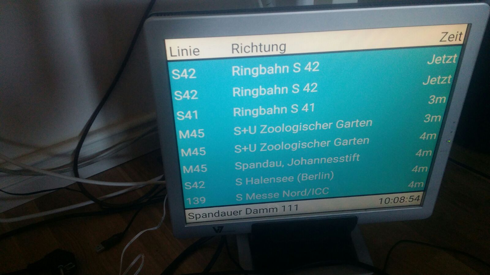

# BVGAnzeige
Small project to visualize when buses and s-bahn arrive in Berlin on Raspberry Pi.

## Installation
1. Install Kivy, look at https://kivy.org/docs/installation/installation.html
If you use raspberry pi, I recommend to use KivyPie.

2. Install bvg-grabber
~~~bash
sudo pip3 install bvg-grabber
~~~
3. Install Executor, that the screen can be turned off in the night.
~~~bash
sudo pip3 install executor
~~~

4. Remove error in bvg-grabber
Search for "actualdeparture.py" and "scheduleddeparture.py"
~~~bash
sudo find / -name "scheduleddeparture.py"
sudo find / -name "actualdeparture.py"
~~~
Change the lines of both files:
~~~python
soup = BeautifulSoup(response.text)
~~~
to
~~~python
soup = BeautifulSoup(response.text, "lxml")
~~~
